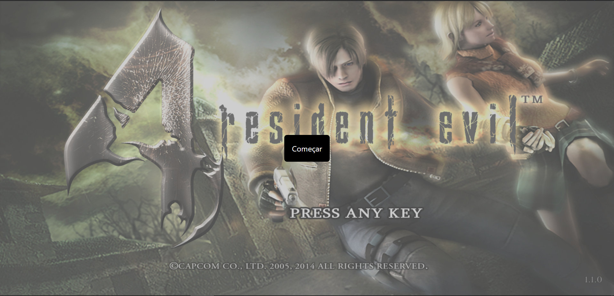
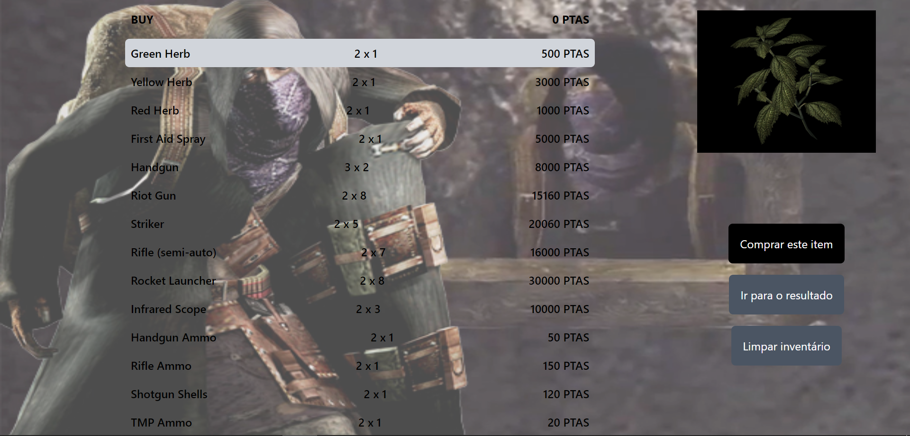
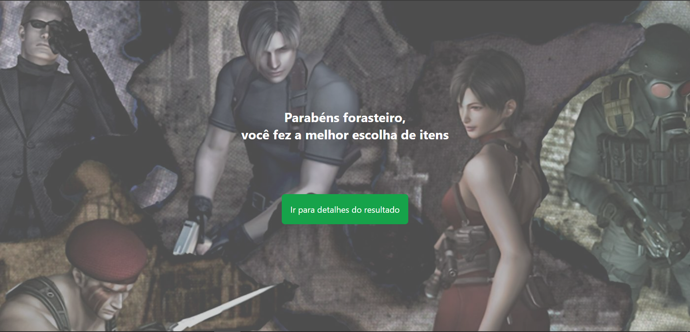
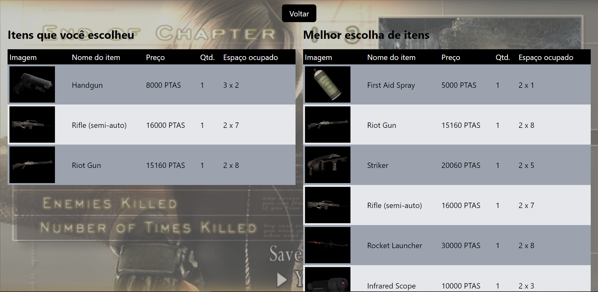

# Re4-Knapsock

**Número da Lista**: undefined<br>
**Conteúdo da Disciplina**: Greed<br>

## Alunos
|Matrícula | Aluno |
| -- | -- |
| 19/0012200  | Douglas da Silva Monteles |
| 17/0016838  |  Lucas Lopes Xavier |

[Apresentação](https://www.youtube.com/watch?v=zHeOzjMzG4E&ab_channel=LucasLopes)

## Sobre 
O problema da mochila é um problema de otimização combinatória: dado um conjunto de itens, cada um com um peso e um valor, determine o número de cada item a ser incluído em uma coleção de modo que o peso total seja menor ou igual a um determinado limite e o valor total é o maior possível. Nesse sentido, aplicamos o algoritmo Knapsock no contexto do famoso jogo de PlayStation 2 chamado Resident Evil 4, onde o personagem principal possui uma maleta que pode ser lotada com itens. Esta maleta é uma matriz NxM e cada item ocupa um espaço também em formato de matriz AxB. No projeto desenvolvido, é possível ir adicionando itens na maleta e ao final, visualizar se a maleta está com os itens mais valiosos dado o espaço disponível. Neste problema, tivemos que adaptar o algoritmo Knapsock, uma vez que no jogo não é levada em consideração o peso dos itens, mas o espaço ocupado por eles.

## Screenshots

### Figura 1: Tela Inicial



### Figura 2: Tela com os itens



### Figura 3: Tela para o caso de escolhas corretas de itens



### Figura 4: Tela para o caso de escolhas erradas de itens


### Figura 5: Tela com os itens que você adicionou e os itens que deveriam ter sido adicionados



## Instalação 
**Linguagem**: Javascript<br>
**Framework**: ReactJS<br>

### Pré-requisitos
- Ter o NodeJS e NPM instalados
- Possuir um navegador (De preferencia utilizar o Google Chrome ou derivado)

### Baixando e executando o projeto

  ```
    git clone https://github.com/projeto-de-algoritmos/Greed_Re4-Knapsock.git

    cd Greed_Re4-Knapsock
    
    cd frontend

    npm install

    npm start    
  ```

- Do seu navegador, acesse <a href="http://localhost:3000">http://localhost:3000</a>

## Uso 
Na página inicial, clique em "Começar", escolha os itens que serão adicionados na maleta e clique em "Ir para o resultado", será exibida uma tela com a mensagem se você tiver adicionado os itens corretamente ou uma mensagem de erro, caso contrário. Independente do resultado, você pode clicar no botão verde para visualizar os detalhes, o quais mostram os itens que você adicionou e os itens que deveriam ter sido adicionados.

## Outros 
Utilize o navegador Google Chrome
